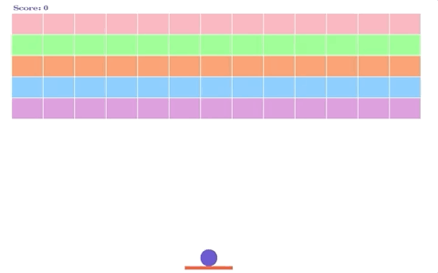

# Breakout Game
A classic 2D game reproduced under C++, X11

## Compilation
In the command window, command "make", the program will compile. 
Then run the game with two parameters: ./breakout frame-rate speed 
Range: 10 - 60 for frame-rate, 0 - 10 for speed 
Recommended values: select speed 5 for the best game experience 

Example:  
make 
./breakout 60 10

## How to Play
On the Welcome screen:
<ul>
<li>Click anywhere to enter the game.</li>
<li>Press "q" to quit the game.</li>
</ul>

Once enter the game:
<ul>
<li>Space: Lauch the ball</li>
<li>Left Arrow: move the paddle left</li>
<li>Right Arrow: move the paddle right </li>
<li>q: quit</li>
</ul>

Once the game ends, the game will ask if you want to continue:
<ul>
<li>y: continue</li>
<li>q: quit</li>
</ul>

 
Notes: 
If the player won and chooses to continue the game, player's score will be kept. 
Otherwise score will be reset. 

The game design is aligned with real world physics. 
If the ball hit the corner of the paddle, it will bounce back. 

## Files
main.cpp
breakout.h breakout.cpp
display.h
block.h block.cpp
paddle.h paddle.cpp
ball.h ball.cpp